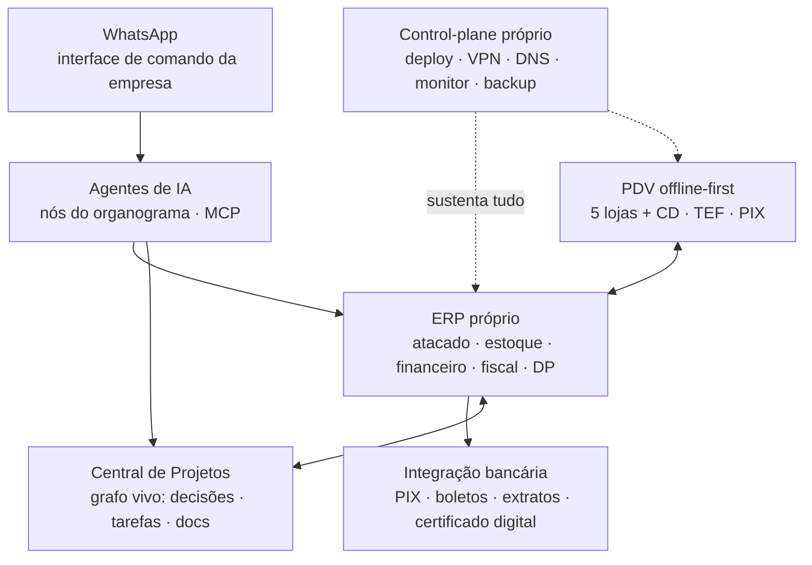

 

**Empresário & builder** — lidero a tecnologia da **Multiverso Atacado**, operação de atacado multi-filial em Minas Gerais 🇧🇷 que roda de ponta a ponta em software construído em casa.

> Eu não vendo software. Eu opero um negócio real — lojas, centro de distribuição, frota e entrega própria — com o software que eu mesmo construo. *Skin in the game* de verdade: se o sistema falha, a loja para.

## O que desenvolvo no dia a dia

- 🏗️ **ERP próprio** — do PDV ao DRE, moldado na operação real (e não o contrário)
- 🛒 **PDV próprio, offline-first** — fluxos de operação personalizados, TEF e PIX integrados no balcão
- 🏦 **Integração bancária própria** — um app que gerencia, adapta e unifica todos os bancos num contrato único
- 🌐 **Infraestrutura própria** — control-plane de deploy/DNS/VPN, lojas resilientes a queda de internet, alertas no WhatsApp
- 🤖 **IA na operação** — agentes como nós do organograma + Central de Projetos com grafo vivo de conhecimento

## A tese

O varejo é meu laboratório. **A empresa é o produto**: cada sistema nasce de uma dor real do chão de loja e é validado na operação no dia seguinte. Tecnologia aqui não é área de suporte — é o motor de margem.

> Cada feature precisa reduzir trabalho manual, reduzir dependência de qualificação, ou gerar um KPI. Senão, não entra.

## O mapa da operação

## Soluções que o mercado não tinha

<b>🧯 Um control-plane de infraestrutura próprio — construído em uma semana</b>

 

Quando precisamos repor nosso painel de infra, fomos ao mercado e não encontramos: uma ferramenta que juntasse **gestão de VPN da frota inteira** (lojas conectadas por túnel, roteador gerenciado), **DNS interno**, **deploy por git com rollback e cofre de variáveis**, **monitoramento com alerta no WhatsApp** e **backup** — do jeito que uma operação de varejo multi-loja precisa, sem virar um cluster complexo de manter.

Então construímos o nosso. Em uma semana a infra inteira já rodava nele. Hoje ele **se auto-deploya a cada push**, com build-gate, health-check e rollback automático — e é a tela única de operação da infraestrutura.

<b>🏗️ Um ERP moldado na operação — e operável por IA</b>

 

ERP de prateleira obriga a empresa a trabalhar do jeito do software. Invertemos: cada tela nasce de uma dor real e é validada por quem não perdoa bug — a operação. Venda de atacado com reserva de estoque em tempo real, estoque com visão fiscal × física, conciliação bancária automática, DRE do dono em tempo real, DP com geração e assinatura digital de documentos, notificação de tudo no WhatsApp.

E a parte que quase ninguém tem: o ERP expõe a operação inteira via **MCP** — agentes de IA usam o sistema com as **mesmas permissões (RBAC) de um usuário humano**. O que um gestor faz na tela, um agente faz por API. Tudo auditado.

<b>🏦 Todos os bancos falando uma língua só</b>

 

Cada banco: uma API diferente, um certificado digital, um jeito próprio de errar. Construímos um app que **gerencia, adapta e unifica** essa selva num contrato único — PIX, boletos, extratos e conciliação multi-banco, com camada própria de autenticação por certificado digital.

O ERP não sabe qual banco está do outro lado. Nem precisa.

<b>🛒 Um PDV que não para — nem sem internet</b>

 

Loja sem internet não pode parar de vender. Nosso PDV é **offline-first**: opera desconectado e sincroniza ao reconectar. Mas o motivo de existir vai além da resiliência: **fluxos de operação personalizados** que nenhum PDV de mercado oferece, **TEF e PIX integrados** direto no balcão, rastreabilidade antifraude — e um **tempo de atendimento no caixa que despencou** depois que redesenhamos o fluxo.

<b>🤖 IA no organograma — e um grafo que é o cérebro da empresa</b>

 

Agentes de IA aqui não são chatbot de FAQ: são **nós do organograma**, com papel, permissões e responsabilidade — operam o ERP via MCP como um funcionário operaria.

E tudo que acontece — decisão, tarefa, ideia, documento — vira nó de um **grafo vivo** numa Central de Projetos própria: decisões linkadas a tarefas, tarefas a código, código a conversas. Qualquer agente (ou pessoa) recupera o contexto completo da empresa em segundos. O WhatsApp fecha o ciclo como **interface de comando**: a empresa se opera por mensagem.

## Atividade

<picture>
  <source media="(prefers-color-scheme: dark)" srcset="https://raw.githubusercontent.com/cesarvcanal/cesarvcanal/output/github-snake-dark.svg">
  
</picture>

Tudo código de produção de uma operação real — nada de commit de enfeite.

## Stack

---

Feito em Minas Gerais · <b>tech@multiversoatacado.com</b>

<b>🇺🇸 English version</b>

 

**Entrepreneur & builder** — I lead technology at **Multiverso Atacado**, a multi-branch wholesale operation in Minas Gerais, Brazil 🇧🇷 that runs end to end on software built in-house.

> I don't sell software. I run a real business — stores, a distribution center, our own fleet and delivery — on software I build myself. Real *skin in the game*: if the system fails, the store stops.

**What I build day to day:** an ERP shaped by the real operation (not the other way around) · an offline-first POS with custom checkout flows, integrated card (TEF) and instant payments (PIX) · a banking layer that unifies every bank into one contract · our own infrastructure control-plane (deploy, DNS, VPN, monitoring with WhatsApp alerts) · AI agents that operate the ERP through MCP with the same role-based permissions as human users, plus a living knowledge graph that acts as the company's brain.

**The thesis:** retail is my laboratory. **The company is the product** — every system is born from a real pain on the store floor and validated in production the next day. Tech here isn't a support area; it's the margin engine.

Highlights devs usually ask about: when we needed to replace our infra panel, nothing on the market combined fleet VPN management, internal DNS, git-based deploys with rollback and WhatsApp alerting the way a multi-store retail operation needs — so we built our own control-plane, and the whole infra was running on it within a week (it now self-deploys on every push, with build gates, health checks and automatic rollback).

